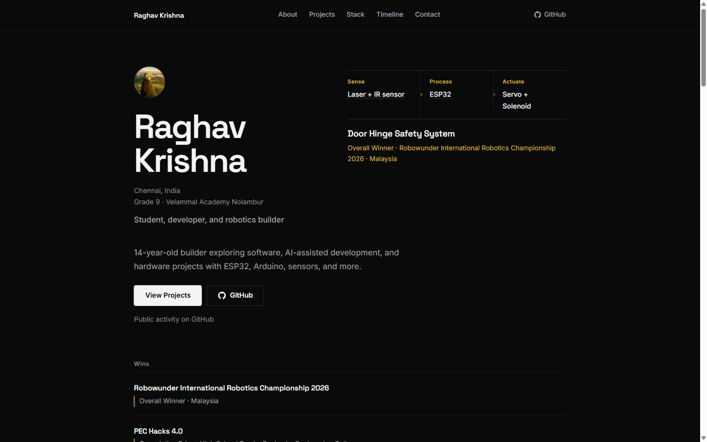

# Raghav Krishna — Portfolio

Personal site of a 14-year-old student, developer, and robotics builder from Chennai.

**Live:** https://raghavkrishna-dev.vercel.app · **GitHub:** [Raghav2012Code](https://github.com/Raghav2012Code)

## Preview



*Home — Space Grotesk + Inter, gold accent, one orchestrated hero entrance.*

## What this is

A two-page portfolio (home + `/project`):

- Hero (name, place, role, intro), then wins strip
- About, selected work (Door Hinge Safety System first), stack, competition timeline
- Public GitHub contribution graph (profile link when the API is unavailable)
- Contact

Design: dark editorial (`#0a0a0b` + gold `#c9a227`). Motion is one hero entrance; **every section below the hero is visible by default**. Reduced motion is global (`MotionConfig reducedMotion="user"` + CSS).

## Highlights

- Featured build: **Door Hinge Safety System** — Overall Winner, Robowunder International Robotics Championship 2026 (Malaysia)
- Hardware-first work (ESP32, sensors, actuators) with web (React, TypeScript) and data projects (XGBoost on CRASH and EPL Predictor)
- All section copy lives in one typed module: [`src/data/content.ts`](src/data/content.ts)

## Stack

| Layer | Choice |
| --- | --- |
| App | React 19 · TypeScript · Vite 8 |
| Motion | `motion/react` — timing only in [`src/lib/motion.ts`](src/lib/motion.ts) |
| UI | Hand-rolled CSS in [`src/index.css`](src/index.css) (Space Grotesk + Inter) |
| Content | [`src/data/content.ts`](src/data/content.ts) |
| Deploy | Vercel (push to `main`) |
| API | [`api/github-contributions.ts`](api/github-contributions.ts) |

## Project structure

```
src/
  data/content.ts         # all section copy + projects
  components/             # section components
  pages/ProjectPage.tsx   # full project list at /project
  lib/motion.ts           # entrance timing only
  lib/contributions.ts    # contribution graph data access
  index.css               # design system
api/
  github-contributions.ts # serverless contribution calendar
index.html                # home entry
project.html              # projects entry
docs/images/              # README screenshots
```

Edit text in `content.ts`; timing only in `motion.ts`.

## Getting started

```sh
npm install
npm run dev      # http://localhost:5173
npm run build    # typecheck + production build
npm run preview  # serve dist/
```

No lint or tests; a green `npm run build` is the bar.

## Deploy

Pushes to `main` auto-deploy (GitHub → Vercel).

- Live alias: https://raghavkrishna-dev.vercel.app
- Canonical URL in `index.html`, `public/robots.txt`, and `public/sitemap.xml`: https://dev-portfolio-azure-nine.vercel.app/
- Keep `.vercelignore` excluding `.playwright-mcp/` and `dist/` (uploading them aborts deploys on slow networks)

## Contribution graph

The one-year public calendar for `Raghav2012Code` is fetched server-side from `api/github-contributions.ts`.

For the deployed graph, set `GITHUB_CONTRIBUTIONS_TOKEN` in the Vercel project environment variables and redeploy. Use a classic personal access token with no scopes; do not grant `read:user`, so the graph stays limited to public activity. Never prefix the variable with `VITE_` or put its value in the repository. Locally, an unset token falls back to a link to the GitHub profile.

## Photos

Profile photo is `GITHUB_AVATAR_URL` in `src/data/content.ts` (currently the GitHub avatar). Point it at `assets/profile.jpg` to use a real photograph. Do not use stock photos as substitutes.

## Project content rules (keep them)

Constraints for anyone editing site copy (humans and agents):

- Projects, in order: Door Hinge Safety System, CRASH, Vaccine Cold Chain Ledger, Volt Ledger, EPL Predictor, Urbania
- Participated-only entries (Technoviz, Shark Tank) stay muted in the timeline; they never enter the achievements strip
- No Habit Tracker anywhere
- No invented awards, jobs, stats, testimonials, or technical details
- No proficiency percentages or expertise claims
- No C++ in skills; no generic AI/ML skill category (XGBoost appears only in the CRASH + EPL cards)
- No LinkedIn (not provided)
- EPL Predictor is a technical project card only. No football-interest section.
- Urbania is a personal experimental 2D city simulation. No stack focus.
- Reduced motion is respected globally (`MotionConfig reducedMotion="user"` + CSS media query)
