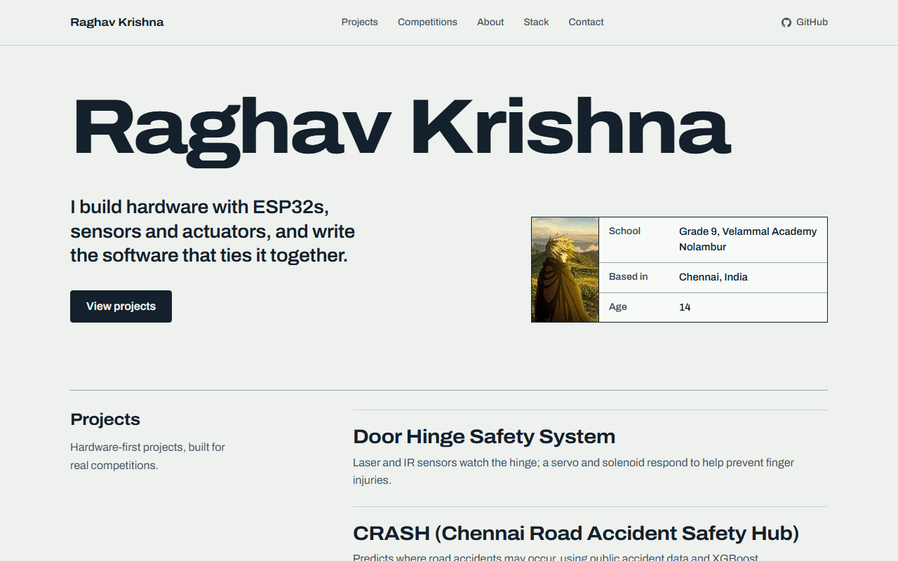
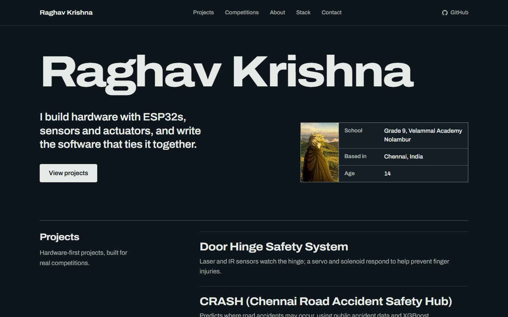

# Raghav Krishna · Portfolio

Portfolio of **Raghav Krishna**, a 14-year-old student, developer and robotics
builder from Chennai, India. I build hardware with ESP32s, sensors and
actuators, and write the software that ties it together.

**[raghavkrishna-dev.vercel.app](https://raghavkrishna-dev.vercel.app)**

[](https://raghavkrishna-dev.vercel.app)


| Light | Dark |
| --- | --- |
|  |  |

## What's inside

The site is designed as a **builder's datasheet on drafting paper**: the name
set as the sheet title, facts in a drafting title block, and every project
written up like a component spec.

| Project | What it is | Links |
| --- | --- | --- |
| **Door Hinge Safety System** | Laser and IR sensors watch the hinge; a servo and solenoid respond to help prevent finger injuries. | [Write-up](https://raghavkrishna-dev.vercel.app/project#door-hinge-safety-system) |
| **CRASH** (Chennai Road Accident Safety Hub) | Predicts where road accidents may occur, using public accident data and XGBoost. | [Repo](https://github.com/abivan100-stack/C.R.A.S.H) |
| **Vaccine Cold Chain Ledger** | A DHT22 sensor tracks vaccine storage temperature, with SHA-256-hashed records in a web app. | [Repo](https://github.com/abivan100-stack/vault) |
| **Volt Ledger** | A tamper-evident ledger for peer-to-peer rooftop solar trading, hashed in the browser. | [Repo](https://github.com/abivan100-stack/volt-ledger) · [Live](https://volt-ledger.vercel.app) |
| **EPL Predictor** | Match-outcome prediction from historical English football data with XGBoost. | [Repo](https://github.com/Raghav2012Code/epl-predictor) |
| **Urbania** | A 2D city simulation for exploring how simulated systems behave. | [Repo](https://github.com/Raghav2012Code/urbania) |

Competition results, the full write-ups and the tech behind each build are on
the [projects page](https://raghavkrishna-dev.vercel.app/project).

## Highlights

- **Two voices, one accent.** Archivo carries every structural job — display
  type, headings, labels, data — and its width axis does the display work;
  Newsreader is reserved for running prose, so the person writing is
  typographically distinct from the sheet describing them. A single PCB green
  marks what is connected or achieved.
- **Light and dark themes** that follow the operating system, with text at
  WCAG AA contrast in both.
- **Calm motion.** One entrance on load, then the page stays still. Reduced
  motion is respected everywhere.
- **Accessible by default.** Skip link, keyboard-friendly menu (Escape closes
  it), a nav that tracks the current section, and tooltips that work with
  screen readers, keyboards and touch.
- **Lean.** React plus `motion` only, with no UI kit. Animation features load
  through `LazyMotion`, so both pages share one small bundle.
- **Live GitHub activity.** A contribution calendar served by a Vercel
  function, cached at the edge.

## Tech stack

| Area | Choice |
| --- | --- |
| Framework | React 19 |
| Language | TypeScript (strict) |
| Build | Vite 8, two HTML entry points (`index.html`, `project.html`) |
| Animation | `motion` (`motion/react`) with `LazyMotion` |
| Styling | Plain CSS with design tokens, light and dark |
| Data | GitHub GraphQL API via a Vercel serverless function |
| Hosting | Vercel |

## Getting started

**Prerequisites:** Node.js `20.19+` or `22.12+` (required by Vite 8) and npm.

```sh
npm install
npm run dev        # dev server on http://localhost:5173
npm run build      # typecheck, then production build to dist/
npm run preview    # serve the production build locally
npm run typecheck  # typecheck only
```

The projects page is served at `/project.html` by the dev server and at
`/project` in production.

There is no test suite. A change is ready when `npm run build` passes, the
browser console is clean, and the page has been checked on desktop and a
390px-wide phone, in both themes.

## Project structure

```text
.
├── index.html                  # Home page entry (meta, fonts, canonical URL)
├── project.html                # Projects page entry
├── api/
│   └── github-contributions.ts # Vercel function: GitHub contribution calendar
├── public/                     # robots.txt, sitemap.xml
├── docs/                       # Agent docs and README screenshots
└── src/
    ├── main.tsx                # Home page bootstrap
    ├── project.tsx             # Projects page bootstrap
    ├── App.tsx                 # Home page sections, in order
    ├── pages/ProjectPage.tsx   # Projects page
    ├── components/
    │   ├── SiteShell.tsx       # Shared frame: skip link, nav, footer, motion setup
    │   ├── Hero.tsx            # Name, statement, drafting title block
    │   ├── Projects.tsx        # Home project index and projects page list
    │   ├── ProjectCard.tsx     # One project as a datasheet entry
    │   ├── Contributions.tsx   # GitHub contribution calendar
    │   ├── ui.tsx              # Section layout, Tip tooltip, brand icons
    │   └── ...                 # About, Timeline, Skills, Contact, Navbar, Footer
    ├── data/content.ts         # All site copy and project data
    ├── lib/                    # Motion timing, contributions client, helpers
    └── index.css               # Design tokens and styles
```

All copy lives in `src/data/content.ts`. To change what the site says, edit it
there; components only render it.

## GitHub contribution graph

The contribution calendar is fetched server-side through
`api/github-contributions.ts`, so the token never reaches the browser.

1. Create a **classic personal access token with no scopes selected**. GitHub's
   GraphQL API needs a token, but a no-scope token already grants
   [read-only access to public information](https://docs.github.com/en/apps/oauth-apps/building-oauth-apps/scopes-for-oauth-apps#available-scopes),
   which is all the calendar reads. Extra scopes such as `read:user` add
   nothing here and widen what a leaked token could do.
2. In the Vercel project, add it as the `GITHUB_CONTRIBUTIONS_TOKEN`
   environment variable and redeploy. Keep the name exactly as written: a
   `VITE_` prefix would expose it to the browser bundle.
3. For local development, put the same variable in `.env.local` (git-ignored)
   or export it in your shell. The dev server runs the same handler.

The graph shows a one-year public contribution calendar for `Raghav2012Code`.
If the API is unavailable or unconfigured, or the GitHub profile has **private
contributions** turned on (Settings, Public profile, Contributions), the section
and the hero count stay hidden, since private counts would otherwise be mixed
into a graph labelled public. Failures are logged in the Vercel function logs
with a short reason.

## Deployment

The site deploys to [Vercel](https://vercel.com). Merging into `main` on
[`Raghav2012Code/dev-portfolio`](https://github.com/Raghav2012Code/dev-portfolio)
triggers a production deploy.

- `vercel.json` enables clean URLs (`/project`) and removes trailing slashes, so
  every page has one address.
- The canonical URL `https://raghavkrishna-dev.vercel.app` is set in both HTML
  entries (canonical and `og:url`), `public/robots.txt` and
  `public/sitemap.xml`. Change all four together.

## Maintaining

### Project content rules (keep them)

- Projects, in order: Door Hinge Safety System, CRASH, Vaccine Cold Chain Ledger, Volt Ledger, EPL Predictor, Urbania
- Participated-only entries (Technoviz, Shark Tank) stay muted in the competitions list; each result appears once on the home page
- No Habit Tracker anywhere
- No invented awards, jobs, stats, testimonials, or technical details
- No proficiency percentages or expertise claims
- No C++ in skills; no generic AI/ML skill category (XGBoost appears only in the CRASH + EPL cards)
- No LinkedIn (not provided)
- EPL Predictor is a technical project card only. No football-interest section.
- Urbania is a personal experimental 2D city simulation. No stack focus.
- Reduced motion is respected globally (`MotionConfig reducedMotion="user"` + CSS media query)

### Photos

The profile photo is `GITHUB_AVATAR_URL` in `src/data/content.ts` (currently
the GitHub avatar). Point it at `assets/profile.jpg` to use a real photograph.
Use real photos only, never stock images.

### Working with AI agents

Conventions for coding agents (motion system, design tokens, shell gotchas,
git flow) live in [`AGENTS.md`](AGENTS.md).

## Contributing

Issues and suggestions are welcome on the
[issue tracker](https://github.com/Raghav2012Code/dev-portfolio/issues).
This is a personal portfolio, so the content itself (projects, results, copy)
is maintained by Raghav.

## Contact

- Email: [raghavgamerz670@gmail.com](mailto:raghavgamerz670@gmail.com)
- GitHub: [@Raghav2012Code](https://github.com/Raghav2012Code)
